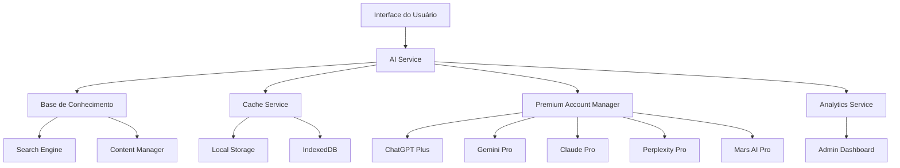

# Sistema de IA Econômica - Design

## Visão Geral

O sistema de IA econômica é projetado para maximizar o valor das assinaturas premium existentes, priorizando sempre a base de conhecimento interna antes de usar recursos externos. A arquitetura é modular, escalável e focada em economia de custos.

## Arquitetura

### Diagrama de Arquitetura



## Componentes e Interfaces

### 1. AI Service (Serviço Principal)

```typescript
// services/aiService.ts
export class AIService {
  private knowledgeBase: KnowledgeBaseService
  private cacheService: CacheService
  private premiumManager: PremiumAccountManager
  private analytics: AnalyticsService

  async processQuery(query: AIQuery): Promise<AIResponse> {
    // 1. Buscar na base interna
    const internalResult = await this.searchInternal(query)
    if (internalResult.confidence > 0.7) {
      this.analytics.trackQuery(query.text, 'internal')
      return internalResult
    }

    // 2. Verificar cache
    const cachedResult = await this.cacheService.get(query.hash)
    if (cachedResult && !cachedResult.isExpired) {
      this.analytics.trackCacheHit(query.text)
      return cachedResult
    }

    // 3. Usar conta premium
    const premiumResult = await this.queryPremium(query)
    if (premiumResult) {
      await this.cacheService.set(query.hash, premiumResult)
      this.analytics.trackQuery(query.text, 'premium', premiumResult.provider)
      return premiumResult
    }

    // 4. Fallback
    return this.getDefaultResponse(query)
  }

  private async searchInternal(query: AIQuery): Promise<AIResponse> {
    const results = await this.knowledgeBase.search({
      text: query.text,
      type: query.type,
      context: query.context
    })

    if (results.length === 0) {
      return { confidence: 0, source: 'internal', content: null }
    }

    // Combinar resultados e calcular confiança
    const combinedResult = this.combineResults(results)
    return {
      confidence: combinedResult.confidence,
      source: 'internal',
      content: combinedResult.content,
      references: combinedResult.references
    }
  }

  private async queryPremium(query: AIQuery): Promise<AIResponse | null> {
    const provider = await this.premiumManager.selectBestProvider(query.type)
    if (!provider) return null

    try {
      const response = await this.premiumManager.query(provider, query)
      await this.premiumManager.trackUsage(provider, response.tokensUsed)
      return response
    } catch (error) {
      console.error(`Error querying ${provider}:`, error)
      return null
    }
  }
}
```

### 2. Knowledge Base Service

```typescript
// services/knowledgeBaseService.ts
export class KnowledgeBaseService {
  private searchEngine: SearchEngine
  private contentManager: ContentManager

  async addKnowledge(entry: KnowledgeEntry): Promise<void> {
    // Validar entrada
    this.validateEntry(entry)
    
    // Calcular confiança inicial
    entry.confidence = this.calculateInitialConfidence(entry)
    
    // Indexar para busca
    await this.searchEngine.index(entry)
    
    // Salvar no banco
    await this.contentManager.save(entry)
  }

  async search(params: SearchParams): Promise<KnowledgeResult[]> {
    // Busca por texto
    const textResults = await this.searchEngine.searchByText(params.text)
    
    // Busca por sintomas (se aplicável)
    const symptomResults = params.symptoms 
      ? await this.searchEngine.searchBySymptoms(params.symptoms)
      : []
    
    // Busca por diagnóstico (se aplicável)
    const diagnosisResults = params.diagnosis
      ? await this.searchEngine.searchByDiagnosis(params.diagnosis)
      : []
    
    // Combinar e ranquear resultados
    const allResults = [...textResults, ...symptomResults, ...diagnosisResults]
    return this.rankResults(allResults, params)
  }

  private calculateInitialConfidence(entry: KnowledgeEntry): number {
    let confidence = 0.5 // Base

    // Bonus por autor experiente
    if (entry.author.experience > 5) confidence += 0.2
    
    // Bonus por referências
    if (entry.references && entry.references.length > 0) confidence += 0.1
    
    // Bonus por detalhamento
    if (entry.content.length > 500) confidence += 0.1
    
    // Bonus por tags relevantes
    if (entry.tags.length >= 3) confidence += 0.1

    return Math.min(confidence, 1.0)
  }

  async updateConfidence(entryId: string, feedback: 'positive' | 'negative'): Promise<void> {
    const entry = await this.contentManager.findById(entryId)
    if (!entry) return

    const adjustment = feedback === 'positive' ? 0.05 : -0.05
    entry.confidence = Math.max(0.1, Math.min(1.0, entry.confidence + adjustment))
    
    await this.contentManager.update(entry)
    await this.searchEngine.updateIndex(entry)
  }
}
```

### 3. Premium Account Manager

```typescript
// services/premiumAccountManager.ts
export class PremiumAccountManager {
  private providers: Map<PremiumProvider, ProviderConfig> = new Map()
  private usageTracker: UsageTracker

  constructor() {
    this.initializeProviders()
  }

  async selectBestProvider(queryType: QueryType): Promise<PremiumProvider | null> {
    const availableProviders = await this.getAvailableProviders()
    const preferredProviders = PROVIDER_STRATEGY[queryType] || []
    
    // Encontrar o primeiro provedor preferido que está disponível
    for (const provider of preferredProviders) {
      if (availableProviders.includes(provider)) {
        return provider
      }
    }
    
    // Se nenhum preferido está disponível, usar qualquer um disponível
    return availableProviders[0] || null
  }

  async getAvailableProviders(): Promise<PremiumProvider[]> {
    const available: PremiumProvider[] = []
    
    for (const [provider, config] of this.providers) {
      if (!config.enabled) continue
      
      const usage = await this.usageTracker.getCurrentUsage(provider)
      if (usage.status === 'available' || usage.status === 'warning') {
        available.push(provider)
      }
    }
    
    return available
  }

  async query(provider: PremiumProvider, query: AIQuery): Promise<AIResponse> {
    const config = this.providers.get(provider)
    if (!config) throw new Error(`Provider ${provider} not configured`)

    switch (provider) {
      case PremiumProvider.CHATGPT_PLUS:
        return this.queryChatGPT(query, config)
      case PremiumProvider.GEMINI_PRO:
        return this.queryGemini(query, config)
      case PremiumProvider.CLAUDE_PRO:
        return this.queryClaude(query, config)
      case PremiumProvider.PERPLEXITY_PRO:
        return this.queryPerplexity(query, config)
      case PremiumProvider.MARS_AI_PRO:
        return this.queryMarsAI(query, config)
      default:
        throw new Error(`Unsupported provider: ${provider}`)
    }
  }

  private async queryChatGPT(query: AIQuery, config: ProviderConfig): Promise<AIResponse> {
    // Implementação específica para ChatGPT Plus
    // Usar web scraping ou API não oficial se necessário
    const response = await this.makeWebRequest(config.endpoint, {
      message: query.text,
      context: query.context
    })

    return {
      content: response.message,
      confidence: 0.8,
      source: 'premium',
      provider: PremiumProvider.CHATGPT_PLUS,
      tokensUsed: this.estimateTokens(query.text + response.message)
    }
  }

  async trackUsage(provider: PremiumProvider, tokensUsed: number): Promise<void> {
    await this.usageTracker.recordUsage(provider, tokensUsed)
    
    const usage = await this.usageTracker.getCurrentUsage(provider)
    
    // Verificar alertas
    if (usage.percentage >= 0.95) {
      await this.sendAlert(provider, 'critical', usage)
    } else if (usage.percentage >= 0.8) {
      await this.sendAlert(provider, 'warning', usage)
    }
  }
}
```

### 4. Cache Service

```typescript
// services/cacheService.ts
export class CacheService {
  private localStorage: Storage
  private indexedDB: IDBDatabase

  async set(key: string, response: AIResponse, ttl?: number): Promise<void> {
    const cacheEntry: CacheEntry = {
      key,
      response,
      createdAt: Date.now(),
      expiresAt: Date.now() + (ttl || this.getDefaultTTL(response.type)),
      accessCount: 0,
      lastAccessed: Date.now()
    }

    // Usar localStorage para cache pequeno e rápido
    if (this.getEntrySize(cacheEntry) < 1024) {
      localStorage.setItem(`ai_cache_${key}`, JSON.stringify(cacheEntry))
    } else {
      // Usar IndexedDB para cache maior
      await this.storeInIndexedDB(cacheEntry)
    }
  }

  async get(key: string): Promise<AIResponse | null> {
    // Tentar localStorage primeiro
    const localEntry = localStorage.getItem(`ai_cache_${key}`)
    if (localEntry) {
      const entry: CacheEntry = JSON.parse(localEntry)
      if (entry.expiresAt > Date.now()) {
        entry.accessCount++
        entry.lastAccessed = Date.now()
        localStorage.setItem(`ai_cache_${key}`, JSON.stringify(entry))
        return entry.response
      } else {
        localStorage.removeItem(`ai_cache_${key}`)
      }
    }

    // Tentar IndexedDB
    const dbEntry = await this.getFromIndexedDB(key)
    if (dbEntry && dbEntry.expiresAt > Date.now()) {
      dbEntry.accessCount++
      dbEntry.lastAccessed = Date.now()
      await this.storeInIndexedDB(dbEntry)
      return dbEntry.response
    }

    return null
  }

  private getDefaultTTL(responseType?: string): number {
    switch (responseType) {
      case 'protocol_suggestion': return CACHE_TTL.PROTOCOL_SUGGESTION
      case 'diagnosis_help': return CACHE_TTL.DIAGNOSIS_HELP
      case 'exercise_recommendation': return CACHE_TTL.EXERCISE_RECOMMENDATION
      default: return CACHE_TTL.GENERAL_QUESTION
    }
  }

  async cleanup(): Promise<void> {
    // Limpar localStorage
    const keysToRemove: string[] = []
    for (let i = 0; i < localStorage.length; i++) {
      const key = localStorage.key(i)
      if (key?.startsWith('ai_cache_')) {
        const entry = JSON.parse(localStorage.getItem(key)!)
        if (entry.expiresAt <= Date.now()) {
          keysToRemove.push(key)
        }
      }
    }
    keysToRemove.forEach(key => localStorage.removeItem(key))

    // Limpar IndexedDB
    await this.cleanupIndexedDB()
  }
}
```

## Data Models

### Knowledge Entry

```typescript
interface KnowledgeEntry {
  id: string
  tenantId: string
  type: 'protocol' | 'exercise' | 'case' | 'technique' | 'experience'
  title: string
  content: string
  summary: string // Resumo automático para busca
  tags: string[]
  author: {
    id: string
    name: string
    role: string
    experience: number // anos de experiência
  }
  confidence: number // 0-1
  usageCount: number
  successRate: number // baseado em feedback
  references: string[] // URLs ou citações
  conditions: string[] // condições médicas relacionadas
  techniques: string[] // técnicas envolvidas
  contraindications: string[]
  createdAt: string
  updatedAt: string
  lastUsed: string
  metadata: {
    difficulty: 'beginner' | 'intermediate' | 'advanced'
    evidenceLevel: 'low' | 'moderate' | 'high'
    specialty: string[]
  }
}
```

### AI Query

```typescript
interface AIQuery {
  id: string
  text: string
  type: QueryType
  context: {
    patientId?: string
    symptoms?: string[]
    diagnosis?: string
    previousTreatments?: string[]
    userRole: string
    specialty?: string
  }
  priority: 'low' | 'normal' | 'high'
  maxResponseTime: number // ms
  hash: string // para cache
  createdAt: string
}

enum QueryType {
  GENERAL_QUESTION = 'general_question',
  PROTOCOL_SUGGESTION = 'protocol_suggestion',
  DIAGNOSIS_HELP = 'diagnosis_help',
  EXERCISE_RECOMMENDATION = 'exercise_recommendation',
  CASE_ANALYSIS = 'case_analysis',
  RESEARCH_QUERY = 'research_query',
  DOCUMENT_ANALYSIS = 'document_analysis'
}
```

### AI Response

```typescript
interface AIResponse {
  id: string
  queryId: string
  content: string
  confidence: number // 0-1
  source: 'internal' | 'cache' | 'premium'
  provider?: PremiumProvider
  references: Reference[]
  suggestions: string[]
  followUpQuestions: string[]
  tokensUsed?: number
  responseTime: number // ms
  createdAt: string
  metadata: {
    evidenceLevel?: 'low' | 'moderate' | 'high'
    reliability: number
    relevance: number
  }
}
```

## Error Handling

### Estratégia de Fallback

1. **Base Interna Falha**: Prosseguir para cache
2. **Cache Falha**: Prosseguir para premium
3. **Premium Falha**: Tentar próximo provedor
4. **Todos Falham**: Retornar resposta padrão educativa

### Tratamento de Erros

```typescript
class AIErrorHandler {
  async handleError(error: AIError, context: ErrorContext): Promise<AIResponse> {
    switch (error.type) {
      case 'KNOWLEDGE_BASE_UNAVAILABLE':
        return this.fallbackToCache(context)
      
      case 'PREMIUM_LIMIT_REACHED':
        return this.tryAlternativeProvider(context)
      
      case 'NETWORK_ERROR':
        return this.useOfflineMode(context)
      
      case 'INVALID_QUERY':
        return this.suggestQueryImprovement(context)
      
      default:
        return this.getGenericErrorResponse(context)
    }
  }
}
```

## Testing Strategy

### Testes Unitários
- Cada serviço isoladamente
- Mocks para APIs externas
- Cobertura > 90%

### Testes de Integração
- Fluxo completo de consulta
- Fallbacks funcionando
- Cache funcionando

### Testes de Performance
- Tempo de resposta < 2s
- Cache hit rate > 70%
- Uso de memória otimizado

### Testes de Economia
- Verificar priorização correta
- Monitorar uso das contas premium
- Validar economia vs. APIs pagas