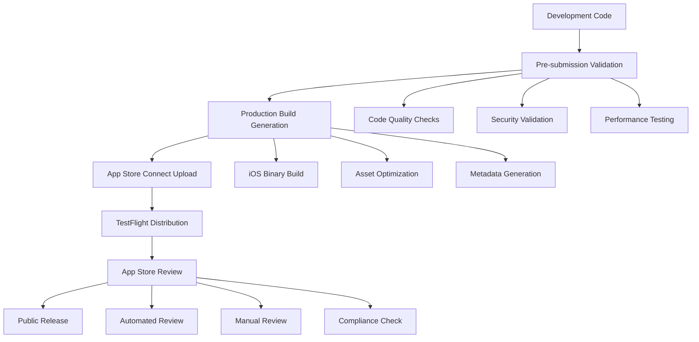
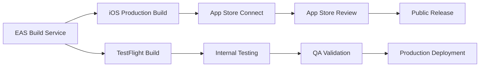

# Design Document

## Overview

This design outlines the comprehensive approach for deploying the FisioFlow mobile application to the Apple App Store. The solution encompasses app store optimization, compliance with Apple guidelines, automated build/deployment processes, and quality assurance workflows. The design leverages the existing Expo/React Native infrastructure while implementing production-ready enhancements.

## Architecture

### App Store Deployment Pipeline



### Build Configuration Architecture



## Components and Interfaces

### 1. Build Configuration System

**EAS Build Profiles**
- **Production Profile**: Optimized builds for App Store submission
- **Preview Profile**: Internal testing builds for TestFlight
- **Development Profile**: Development and debugging builds

**Configuration Files:**
- `eas.json`: Build and submission configuration
- `app.json`: App metadata and iOS-specific settings
- `app.config.js`: Dynamic configuration management

### 2. App Store Metadata Management

**App Store Connect Integration**
- App information and descriptions
- Screenshots and preview videos
- Pricing and availability settings
- Review information and notes

**Localization Support**
- Portuguese (Brazil) as primary language
- Localized app descriptions and keywords
- Localized screenshots and metadata

### 3. Compliance and Privacy System

**Privacy Policy Integration**
- LGPD compliance for Brazilian users
- Apple privacy requirements
- Data collection transparency
- User consent management

**Permissions Management**
- Camera access for exercise documentation
- Photo library access for image attachments
- Background processing for notifications
- Proper usage descriptions in Info.plist

### 4. Quality Assurance Framework

**Automated Testing Pipeline**
- Unit tests for core functionality
- Integration tests for API interactions
- E2E tests for critical user flows
- Performance testing for iOS devices

**Device Testing Matrix**
- iPhone models (12, 13, 14, 15 series)
- iPad support (if applicable)
- iOS version compatibility (iOS 14+)
- Different screen sizes and orientations

## Data Models

### App Store Metadata Model

```typescript
interface AppStoreMetadata {
  appName: string;
  subtitle: string;
  description: string;
  keywords: string[];
  category: AppStoreCategory;
  contentRating: ContentRating;
  screenshots: Screenshot[];
  previewVideos: PreviewVideo[];
  appIcon: AppIcon;
  version: string;
  buildNumber: string;
  releaseNotes: string;
  reviewNotes: string;
  localizations: Localization[];
}

interface Screenshot {
  deviceType: DeviceType;
  imageUrl: string;
  displayOrder: number;
  localization: string;
}

interface Localization {
  language: string;
  appName: string;
  subtitle: string;
  description: string;
  keywords: string[];
  releaseNotes: string;
}
```

### Build Configuration Model

```typescript
interface BuildConfiguration {
  platform: 'ios';
  profile: 'production' | 'preview' | 'development';
  bundleIdentifier: string;
  version: string;
  buildNumber: string;
  distribution: 'store' | 'internal';
  codeSigningIdentity: string;
  provisioningProfile: string;
  entitlements: Entitlements;
}

interface Entitlements {
  backgroundModes: string[];
  cameraUsage: boolean;
  photoLibraryUsage: boolean;
  pushNotifications: boolean;
}
```

## Error Handling

### Build Process Error Handling

**Build Failures**
- Automatic retry mechanism for transient failures
- Detailed error logging and reporting
- Fallback to previous successful build configuration
- Developer notification system for critical failures

**Submission Errors**
- App Store Connect API error handling
- Metadata validation error recovery
- Binary upload failure recovery
- Review rejection handling workflow

### Runtime Error Handling

**App Store Review Preparation**
- Crash reporting integration (Sentry/Bugsnag)
- Performance monitoring setup
- Error boundary implementation
- Graceful degradation for network issues

**User Experience Protection**
- Offline functionality for core features
- Loading states and error messages
- Data persistence during app updates
- Smooth onboarding experience

## Testing Strategy

### Pre-submission Testing

**Automated Test Suite**
1. **Unit Tests**: Core business logic validation
2. **Integration Tests**: API and service integration
3. **Component Tests**: UI component functionality
4. **E2E Tests**: Critical user journey validation

**Manual Testing Checklist**
1. **Device Compatibility**: Test on multiple iOS devices
2. **Performance Testing**: App launch time, memory usage
3. **Accessibility Testing**: VoiceOver and accessibility features
4. **Localization Testing**: Portuguese language support
5. **Privacy Compliance**: Data handling and permissions

### TestFlight Beta Testing

**Internal Testing Phase**
- Development team validation
- Core functionality verification
- Performance benchmarking
- Crash and bug identification

**External Testing Phase**
- Limited user group testing
- Real-world usage scenarios
- Feedback collection and analysis
- Final pre-release validation

### App Store Review Preparation

**Review Guidelines Compliance**
- Content and functionality review
- Privacy policy validation
- Age rating accuracy
- Metadata consistency check

**Technical Requirements Validation**
- iOS version compatibility
- Device performance requirements
- App size optimization
- Binary validation

## Implementation Phases

### Phase 1: App Store Preparation
- App Store Connect account setup
- Bundle identifier configuration
- Certificates and provisioning profiles
- Initial metadata preparation

### Phase 2: Build Pipeline Setup
- EAS build configuration optimization
- Automated build scripts enhancement
- TestFlight integration setup
- Quality assurance automation

### Phase 3: Compliance Implementation
- Privacy policy integration
- LGPD compliance features
- Apple guidelines adherence
- Security and permissions audit

### Phase 4: Testing and Validation
- Comprehensive testing execution
- Beta testing program launch
- Performance optimization
- Bug fixes and improvements

### Phase 5: App Store Submission
- Final metadata optimization
- App Store review submission
- Review process management
- Public release coordination

## Success Metrics

**Technical Metrics**
- Build success rate: >95%
- App crash rate: <0.1%
- App launch time: <3 seconds
- App Store review approval: First submission

**Business Metrics**
- App Store search ranking for "fisioterapia"
- Download conversion rate from listing views
- User retention rate post-installation
- App Store rating: >4.5 stars

**Operational Metrics**
- Deployment frequency: Weekly releases
- Time to production: <24 hours
- Rollback capability: <1 hour
- Support ticket volume: <5% of users