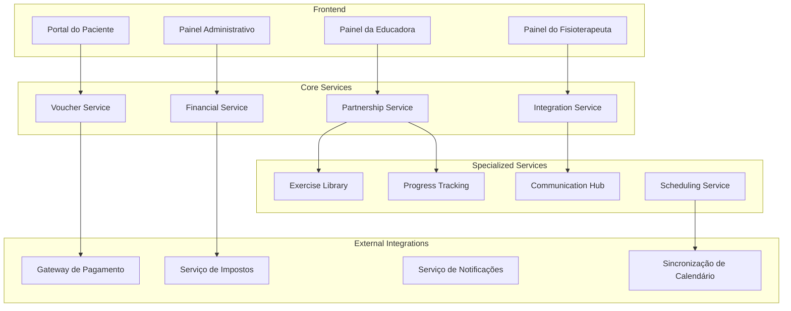

# Sistema de Parceria com Educadora Física - Design

## Visão Geral

O sistema de parceria com educadora física é uma extensão do FisioFlow que permite integração completa entre fisioterapia e educação física, oferecendo aos pacientes serviços complementares através de vouchers, com gestão financeira separada e transparente para todos os envolvidos.

## Arquitetura

### Diagrama de Arquitetura



## Componentes e Interfaces

### 1. Partnership Service (Serviço Principal de Parceria)

```typescript
// services/partnership/partnershipService.ts
export class PartnershipService {
  private voucherService: VoucherService
  private financialService: FinancialService
  private integrationService: IntegrationService
  private exerciseLibrary: ExerciseLibraryService

  async createPartnership(config: PartnershipConfig): Promise<Partnership> {
    // Criar parceria com configurações específicas
    const partnership = await this.validateAndCreatePartnership(config)
    
    // Configurar taxas e comissões
    await this.financialService.setupCommissionStructure(partnership.id, config.commissions)
    
    // Configurar integração com sistema existente
    await this.integrationService.setupIntegration(partnership.id, config.integrations)
    
    // Configurar biblioteca de exercícios compartilhada
    await this.exerciseLibrary.setupSharedLibrary(partnership.id)
    
    return partnership
  }

  async getEducatorDashboard(educatorId: string): Promise<EducatorDashboard> {
    const activeClients = await this.getActiveClients(educatorId)
    const financialSummary = await this.financialService.getEducatorSummary(educatorId)
    const performanceMetrics = await this.getPerformanceMetrics(educatorId)
    const upcomingSessions = await this.getUpcomingSessions(educatorId)

    return {
      activeClients,
      financialSummary,
      performanceMetrics,
      upcomingSessions,
      recentActivity: await this.getRecentActivity(educatorId),
      notifications: await this.getNotifications(educatorId)
    }
  }

  async getClientIntegratedHistory(clientId: string, educatorId: string): Promise<IntegratedHistory> {
    // Buscar histórico de fisioterapia
    const physioHistory = await this.integrationService.getPhysioHistory(clientId)
    
    // Buscar histórico de treinos
    const trainingHistory = await this.getTrainingHistory(clientId, educatorId)
    
    // Combinar e sincronizar dados
    return this.combineHistories(physioHistory, trainingHistory)
  }
}
```

### 2. Voucher Service (Serviço de Vouchers)

```typescript
// services/partnership/voucherService.ts
export class VoucherService {
  private paymentService: PaymentService
  private notificationService: NotificationService

  async createVoucherPlan(plan: VoucherPlan): Promise<VoucherPlan> {
    // Validar plano
    this.validatePlan(plan)
    
    // Configurar preços e benefícios
    plan.pricing = await this.calculatePricing(plan)
    
    // Configurar regras de uso
    plan.usageRules = this.setupUsageRules(plan)
    
    return await this.savePlan(plan)
  }

  async purchaseVoucher(purchase: VoucherPurchase): Promise<VoucherTransaction> {
    // Processar pagamento
    const payment = await this.paymentService.processPayment({
      amount: purchase.amount,
      patientId: purchase.patientId,
      planId: purchase.planId,
      paymentMethod: purchase.paymentMethod
    })

    if (payment.status === 'approved') {
      // Gerar voucher
      const voucher = await this.generateVoucher(purchase, payment)
      
      // Enviar confirmações
      await this.sendVoucherConfirmation(voucher)
      
      // Ativar serviços
      await this.activateServices(voucher)
      
      return {
        voucher,
        payment,
        status: 'completed'
      }
    }

    throw new Error('Payment failed')
  }

  async activateVoucher(voucherId: string, patientId: string): Promise<VoucherActivation> {
    const voucher = await this.findVoucher(voucherId)
    
    // Validar voucher
    this.validateVoucherActivation(voucher, patientId)
    
    // Ativar serviços
    const activation = await this.activateVoucherServices(voucher)
    
    // Notificar educadora
    await this.notifyEducatorNewClient(voucher.educatorId, patientId)
    
    // Configurar acesso
    await this.setupClientAccess(voucher, patientId)
    
    return activation
  }

  private async generateVoucher(purchase: VoucherPurchase, payment: Payment): Promise<Voucher> {
    return {
      id: this.generateVoucherId(),
      code: this.generateVoucherCode(),
      patientId: purchase.patientId,
      educatorId: purchase.educatorId,
      planId: purchase.planId,
      purchaseDate: new Date(),
      activationDate: null,
      expiryDate: this.calculateExpiryDate(purchase.planId),
      status: 'purchased',
      services: await this.getIncludedServices(purchase.planId),
      remainingCredits: await this.getInitialCredits(purchase.planId),
      paymentId: payment.id
    }
  }
}
```

### 3. Financial Service (Serviço Financeiro)

```typescript
// services/partnership/financialService.ts
export class FinancialService {
  private taxService: TaxService
  private paymentProcessor: PaymentProcessor

  async getEducatorFinancialDashboard(educatorId: string): Promise<EducatorFinancialDashboard> {
    const currentMonth = new Date().getMonth()
    const currentYear = new Date().getFullYear()

    return {
      summary: {
        grossRevenue: await this.getGrossRevenue(educatorId, currentMonth, currentYear),
        platformFee: await this.getPlatformFee(educatorId, currentMonth, currentYear),
        taxAmount: await this.getTaxAmount(educatorId, currentMonth, currentYear),
        netRevenue: await this.getNetRevenue(educatorId, currentMonth, currentYear),
        pendingPayouts: await this.getPendingPayouts(educatorId)
      },
      transactions: await this.getRecentTransactions(educatorId),
      payouts: await this.getPayoutHistory(educatorId),
      analytics: await this.getRevenueAnalytics(educatorId)
    }
  }

  async processEducatorPayout(educatorId: string, amount: number): Promise<Payout> {
    // Validar saldo disponível
    const availableBalance = await this.getAvailableBalance(educatorId)
    if (amount > availableBalance) {
      throw new Error('Insufficient balance')
    }

    // Calcular taxas
    const fees = await this.calculatePayoutFees(amount)
    const netAmount = amount - fees.total

    // Processar transferência
    const payout = await this.paymentProcessor.transfer({
      recipientId: educatorId,
      amount: netAmount,
      fees: fees,
      description: 'Educator payout'
    })

    // Registrar transação
    await this.recordPayoutTransaction(educatorId, payout)

    // Notificar educadora
    await this.notifyPayoutProcessed(educatorId, payout)

    return payout
  }

  async calculateCommissions(transaction: Transaction): Promise<CommissionBreakdown> {
    const config = await this.getCommissionConfig(transaction.educatorId)
    
    const breakdown: CommissionBreakdown = {
      grossAmount: transaction.amount,
      platformFee: transaction.amount * config.platformFeeRate,
      taxAmount: 0,
      netAmount: 0
    }

    // Calcular impostos
    breakdown.taxAmount = await this.taxService.calculateTax({
      amount: breakdown.grossAmount,
      serviceType: 'physical_education',
      educatorId: transaction.educatorId
    })

    // Calcular líquido
    breakdown.netAmount = breakdown.grossAmount - breakdown.platformFee - breakdown.taxAmount

    return breakdown
  }

  async setupCommissionStructure(partnershipId: string, config: CommissionConfig): Promise<void> {
    // Validar configuração
    this.validateCommissionConfig(config)
    
    // Salvar configuração
    await this.saveCommissionConfig(partnershipId, config)
    
    // Configurar alertas automáticos
    await this.setupCommissionAlerts(partnershipId, config)
  }

  private validateCommissionConfig(config: CommissionConfig): void {
    if (config.platformFeeRate < 0 || config.platformFeeRate > 0.3) {
      throw new Error('Platform fee rate must be between 0% and 30%')
    }
    
    if (config.minimumPayout < 50) {
      throw new Error('Minimum payout must be at least R$ 50')
    }
  }
}
```

### 4. Integration Service (Serviço de Integração)

```typescript
// services/partnership/integrationService.ts
export class IntegrationService {
  private physioService: PhysiotherapyService
  private exerciseService: ExerciseService
  private communicationService: CommunicationService

  async getIntegratedPatientData(patientId: string, educatorId: string): Promise<IntegratedPatientData> {
    // Verificar permissões
    await this.validateAccess(patientId, educatorId)
    
    // Buscar dados de fisioterapia
    const physioData = await this.physioService.getPatientData(patientId)
    
    // Buscar dados de treino
    const trainingData = await this.getTrainingData(patientId, educatorId)
    
    // Combinar dados
    return this.combinePatientData(physioData, trainingData)
  }

  async syncExerciseLibraries(educatorId: string): Promise<SyncResult> {
    // Buscar exercícios da educadora
    const educatorExercises = await this.getEducatorExercises(educatorId)
    
    // Buscar exercícios da clínica
    const clinicExercises = await this.exerciseService.getClinicExercises()
    
    // Identificar novos exercícios para sincronizar
    const newEducatorExercises = this.findNewExercises(educatorExercises, clinicExercises)
    const newClinicExercises = this.findNewExercises(clinicExercises, educatorExercises)
    
    // Sincronizar (com aprovação quando necessário)
    const syncResult: SyncResult = {
      educatorToClinic: await this.syncEducatorToClinic(newEducatorExercises),
      clinicToEducator: await this.syncClinicToEducator(newClinicExercises),
      conflicts: await this.identifyConflicts(educatorExercises, clinicExercises)
    }
    
    return syncResult
  }

  async createCommunicationChannel(patientId: string, physioId: string, educatorId: string): Promise<CommunicationChannel> {
    const channel = await this.communicationService.createChannel({
      type: 'patient_care',
      participants: [physioId, educatorId],
      subject: `Patient: ${patientId}`,
      metadata: {
        patientId,
        priority: 'normal',
        autoArchive: false
      }
    })

    // Configurar notificações
    await this.setupChannelNotifications(channel.id, [physioId, educatorId])
    
    // Criar contexto inicial
    await this.createInitialContext(channel.id, patientId)
    
    return channel
  }

  async trackProgressIntegration(patientId: string, educatorId: string, progress: ProgressUpdate): Promise<void> {
    // Registrar progresso no sistema da educadora
    await this.recordEducatorProgress(educatorId, patientId, progress)
    
    // Sincronizar com sistema de fisioterapia
    await this.syncWithPhysioSystem(patientId, progress)
    
    // Verificar alertas automáticos
    await this.checkProgressAlerts(patientId, progress)
    
    // Notificar profissionais se necessário
    if (progress.requiresAttention) {
      await this.notifyProfessionals(patientId, progress)
    }
  }
}
```

### 5. Exercise Library Service (Serviço de Biblioteca de Exercícios)

```typescript
// services/partnership/exerciseLibraryService.ts
export class ExerciseLibraryService {
  private approvalService: ApprovalService
  private versionControl: VersionControlService

  async setupSharedLibrary(partnershipId: string): Promise<SharedLibrary> {
    const library = await this.createSharedLibrary({
      partnershipId,
      permissions: {
        educator: ['read', 'create', 'suggest'],
        physiotherapist: ['read', 'create', 'approve', 'modify'],
        admin: ['all']
      },
      syncRules: {
        autoSync: true,
        requireApproval: true,
        conflictResolution: 'physiotherapist_priority'
      }
    })

    return library
  }

  async addExerciseToLibrary(exercise: Exercise, authorId: string, authorType: 'educator' | 'physiotherapist'): Promise<ExerciseEntry> {
    // Validar exercício
    await this.validateExercise(exercise)
    
    // Criar entrada na biblioteca
    const entry: ExerciseEntry = {
      ...exercise,
      id: this.generateExerciseId(),
      authorId,
      authorType,
      status: authorType === 'physiotherapist' ? 'approved' : 'pending_approval',
      createdAt: new Date(),
      version: 1,
      tags: await this.generateAutoTags(exercise),
      contraindications: await this.identifyContraindications(exercise)
    }

    // Salvar na biblioteca
    await this.saveExerciseEntry(entry)
    
    // Se precisa aprovação, notificar
    if (entry.status === 'pending_approval') {
      await this.notifyForApproval(entry)
    }
    
    // Se aprovado, sincronizar
    if (entry.status === 'approved') {
      await this.syncToAllLibraries(entry)
    }
    
    return entry
  }

  async getPersonalizedExercises(patientId: string, educatorId: string, criteria: ExerciseCriteria): Promise<Exercise[]> {
    // Buscar histórico médico relevante
    const medicalHistory = await this.getMedicalHistory(patientId)
    
    // Buscar exercícios compatíveis
    const compatibleExercises = await this.findCompatibleExercises(criteria, medicalHistory)
    
    // Filtrar por contraindicações
    const safeExercises = this.filterByContraindications(compatibleExercises, medicalHistory)
    
    // Personalizar baseado em progresso
    const personalizedExercises = await this.personalizeByProgress(safeExercises, patientId)
    
    // Ordenar por relevância
    return this.sortByRelevance(personalizedExercises, criteria)
  }

  async trackExerciseProgress(patientId: string, exerciseId: string, progress: ExerciseProgress): Promise<void> {
    // Registrar progresso
    await this.recordProgress(patientId, exerciseId, progress)
    
    // Atualizar métricas do exercício
    await this.updateExerciseMetrics(exerciseId, progress)
    
    // Verificar se precisa progressão
    const needsProgression = await this.checkProgressionNeeds(patientId, exerciseId, progress)
    
    if (needsProgression) {
      // Sugerir progressão
      const suggestions = await this.generateProgressionSuggestions(patientId, exerciseId)
      await this.notifyProgressionSuggestions(patientId, suggestions)
    }
    
    // Verificar alertas de segurança
    await this.checkSafetyAlerts(patientId, exerciseId, progress)
  }
}
```

## Data Models

### Partnership Models

```typescript
interface Partnership {
  id: string
  clinicId: string
  educatorId: string
  status: 'active' | 'suspended' | 'terminated'
  startDate: Date
  endDate?: Date
  config: PartnershipConfig
  metrics: PartnershipMetrics
  createdAt: Date
  updatedAt: Date
}

interface PartnershipConfig {
  commissions: CommissionConfig
  services: ServiceConfig[]
  integrations: IntegrationConfig
  policies: PolicyConfig
}

interface CommissionConfig {
  platformFeeRate: number // 0.05 = 5%
  taxHandling: 'automatic' | 'manual'
  payoutSchedule: 'weekly' | 'biweekly' | 'monthly'
  minimumPayout: number
  currency: string
}
```

### Voucher Models

```typescript
interface Voucher {
  id: string
  code: string
  patientId: string
  educatorId: string
  planId: string
  status: 'purchased' | 'activated' | 'expired' | 'cancelled'
  purchaseDate: Date
  activationDate?: Date
  expiryDate: Date
  services: VoucherService[]
  remainingCredits: number
  totalCredits: number
  paymentId: string
  metadata: VoucherMetadata
}

interface VoucherPlan {
  id: string
  name: string
  description: string
  educatorId: string
  pricing: PlanPricing
  services: PlanService[]
  duration: number // dias
  credits: number
  restrictions: PlanRestriction[]
  isActive: boolean
}

interface PlanPricing {
  basePrice: number
  discounts: Discount[]
  currency: string
  billingCycle: 'one_time' | 'monthly' | 'quarterly'
}
```

### Financial Models

```typescript
interface EducatorFinancialDashboard {
  summary: FinancialSummary
  transactions: Transaction[]
  payouts: Payout[]
  analytics: RevenueAnalytics
}

interface FinancialSummary {
  grossRevenue: number
  platformFee: number
  taxAmount: number
  netRevenue: number
  pendingPayouts: number
  availableBalance: number
  currency: string
  period: DateRange
}

interface Transaction {
  id: string
  type: 'voucher_purchase' | 'service_payment' | 'refund'
  amount: number
  educatorId: string
  patientId: string
  status: 'pending' | 'completed' | 'failed' | 'refunded'
  breakdown: CommissionBreakdown
  createdAt: Date
  processedAt?: Date
}
```

### Integration Models

```typescript
interface IntegratedPatientData {
  patient: PatientBasicInfo
  physioHistory: PhysiotherapyHistory
  trainingHistory: TrainingHistory
  combinedProgress: CombinedProgress
  restrictions: MedicalRestriction[]
  goals: TreatmentGoal[]
  communications: CommunicationHistory[]
}

interface CombinedProgress {
  timeline: ProgressEvent[]
  metrics: CombinedMetrics
  achievements: Achievement[]
  concerns: ProgressConcern[]
}

interface ProgressEvent {
  date: Date
  type: 'physio_session' | 'training_session' | 'assessment' | 'milestone'
  source: 'physiotherapist' | 'educator' | 'patient'
  data: any
  notes?: string
}
```

## Error Handling

### Estratégias de Tratamento de Erro

```typescript
class PartnershipErrorHandler {
  async handlePaymentError(error: PaymentError, context: PaymentContext): Promise<PaymentRecovery> {
    switch (error.type) {
      case 'INSUFFICIENT_FUNDS':
        return this.handleInsufficientFunds(context)
      
      case 'CARD_DECLINED':
        return this.handleCardDeclined(context)
      
      case 'NETWORK_ERROR':
        return this.handleNetworkError(context)
      
      default:
        return this.handleGenericPaymentError(error, context)
    }
  }

  async handleIntegrationError(error: IntegrationError): Promise<IntegrationRecovery> {
    // Log error for monitoring
    await this.logIntegrationError(error)
    
    // Attempt recovery based on error type
    switch (error.type) {
      case 'DATA_SYNC_FAILED':
        return this.retryDataSync(error.context)
      
      case 'PERMISSION_DENIED':
        return this.escalatePermissionIssue(error.context)
      
      case 'SERVICE_UNAVAILABLE':
        return this.useOfflineMode(error.context)
    }
  }
}
```

## Testing Strategy

### Testes Específicos para Parceria

```typescript
describe('Partnership System', () => {
  describe('Voucher Purchase Flow', () => {
    it('should complete voucher purchase successfully', async () => {
      // Test complete flow from selection to activation
    })
    
    it('should handle payment failures gracefully', async () => {
      // Test payment failure scenarios
    })
    
    it('should apply correct commission calculations', async () => {
      // Test financial calculations
    })
  })
  
  describe('Integration Features', () => {
    it('should sync exercise libraries correctly', async () => {
      // Test exercise synchronization
    })
    
    it('should combine patient data accurately', async () => {
      // Test data integration
    })
    
    it('should maintain data consistency', async () => {
      // Test data consistency across systems
    })
  })
})
```